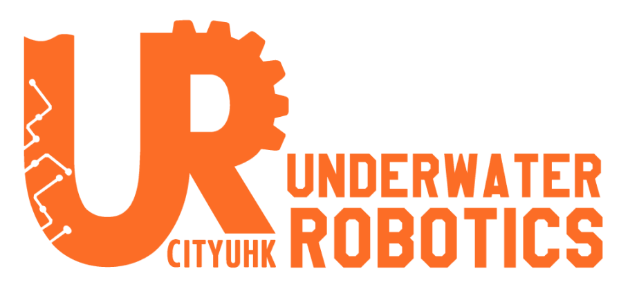

<h1>ROS2 Vision Node</h1>
A docker service containing ROS2 packages for isaac ros apriltag.

## Dependencies
1. <a href="https://github.com/CityUHKUR/oakd-node-ros2.git">ROS2 OAK-D Node</a> for stereo & color image.
2. <a href="https://github.com/CityUHKUR/pixhawk-node-ros2.git"> ROS2 Pixhawk Node </a> for IMU data.
3. Docker
4. CUDA
5. Jetson device (Orin nano, etc.)

## Installation
1. Clone this repository & install dependencies
2. `docker compose up --build`
